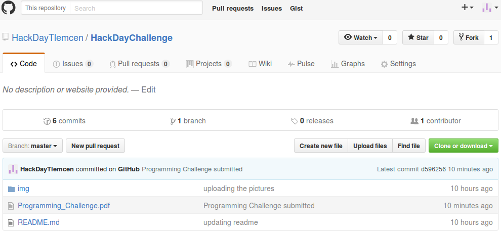
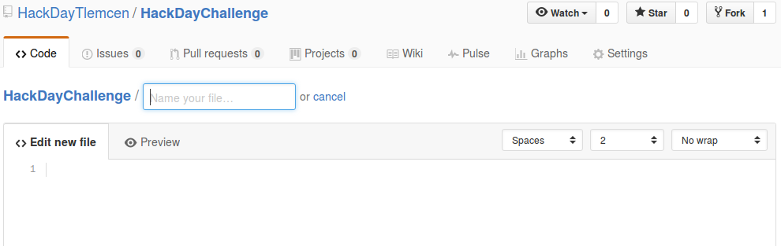

# HackDay Challenge
## Welcome to the HackDay Programming Challenge !!
This is a service that allows participants of the _Local Hack Day_ of _Tlemcen_ to submit their solutions for the given exercise. The organizer of the event gives the participants an URL which leads to this page. In this page, you will find a programming exercise in the file **Programming_Challenge.pdf**.

This page represents a repository containing our exercise,it will also contain your proposed solution after you submit it.
 
## How to use this repository ?
First,  you will want to fork the repository, you can do this by pressing the **Fork button** on the top of this page. Now you have a copy of this repository on your account.

You can now press on the **Create new file** button to add a file which contains your program to the repository. 
Once the file is open you will have a page like this:

After giving a name to your file (do not forget the extension) you can proceed to the programming step.
When you finish, you can go to the page bottom to submit your changes. you will find something like this:

You can give a title and a description of the file you have created and press on the **Propose new file** button (see the picture).
On the next page, you can press on **Create pull request** button to send your file to the jury.

 
Your file is now submitted. The results will be announced by the jury after correction.
Thank you for your participation.

                                                                               Autobot13 team.
